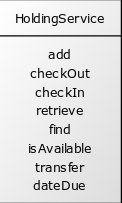

In chapter [x], you learned how to best organize code statements and expressions in the form of functions or methods. [[ READ ]]

Hopefully the most useful things you learned are:

* Functions provide a way to declare, invoke, and reuse pieces of logical behavior, or *concepts*.
* While nothing prevents you from aggregating multiple concepts into a single function, you're much better off if you compose methods that capture small, discrete concepts.

In this chapter, you'll hear echoes of the advice from chapter [x] at the next-up organizational construct: classes or modules.

## Classes and Modules vs. Files

Your programming language allows you to group concepts into a single construct--a *class*, if you're coding with an object-oriented language, or perhaps a *module* if you program in a primarily functional language like JavaScript, Elixir, or F#.

In some object-oriented languages, such as Java, a file can declare only a single, publicly available class. Other languages, such as C++, TypeScript, and Ruby, allow you to declare multiple classes within a single file.

To make matters more confusing, some languages (both OO and functional) allow you to declare *namespaces*. These can help you avoid name clashes across a larger system. They can also help you organize related concepts. For our purposes, consider that the primary use of a namespace is to group related concepts.

Most functional languages--for example, Clojure, Elixir, and Haskell--allow you to organize functions into multiple, separate modules within a file. Even for languages that don't directly support modules/namespaces within the language (JavaScript comes to mind), you can organize multiple "virtual" modules within a single source file.

Just because you can doesn't mean you should. *Generally*, stick to a single module or class per source file. You'll create fewer headaches for you and your dev team.

Everything is a tradeoff in software development, of course, and thus exceptions always exist. You might find it useful to declare other very closely-related classes within the same sourcefile, such as small structs (e.g. `record`s in Java) or exception types. Perhaps they are consumed only by other types within the same file, or they always appear in client code that also involves the file's primary type.

(All of this, of course, means little to those devious Smalltalk programmers, who have the audacity to not even use files when it comes to organizing code.)

But, yeah, for the most part: class <=> file, or module <=> file, or whatever. Consider the file part of things mostly not relevant in our discussions this chapter. We're going to focus instead about how to properly group `concepts` in classes and modules. For the most part, the considerations are going to be the same. [[ what does that mean ]]

[[ FUNCTIONS and "type"?? ]]


[[ SOLID - post agile ]]

## What *Should* a Class Contain

You could conceivably lump together your system's entire set of methods into a single class. You could, similarly perversely, create a separate class for each and every method. Both are outrageous ideas, though I've done the former for very small systems, and perhaps the second isn't so outrageous for some Smalltalkers.

Classes provide ways to help you keep your sanity as your system grows. Without sensible organization, you will:

* have a harder time finding the code you're looking for
* bloat your system with considerable redundancy; doubling it in size is easily in range
* create defects around inconsistent behaviors, due to the redundancies
* create defects due to increasing complexity (...)
* spend extensive amounts of time writing automated tests for it
* ...

All those outcomes increase in likelihood with growth, in turn increasing your costs and frustrations.

We'll talk about "clean class design" throughout this chapter. In your head, translate that to "doing all the things that should make our development lives easier."

"Clean" isn't a ding at anyone. Our notion of "unclean" is a way of characterizing code that demands more effort from the average developer to understand or maintain.

## Characterizing Class Design

The quality of a design can only truly be assessed in the face of change, change that occurs each time the system must take on new features. Is it getting increasingly costlier to introduce new features as the system grows and ages? Is the number of defects increasing? 

Across seven decades of software development, we've gathered empirical data from our  experiences with change. We've gleaned valuable insights from that data, and continually extrapolated those learnings into larger and newer contexts.

In the late 1940s, a system *was* implemented like our degenerate example, with the entire set of code essentially stored in a single function, to be read and executed top-to-bottom.

John von Neumann and Herman Goldstine's article, "Planning and Coding of Problems for an Electronic Computing Instrument" explored the premise of a subroutine: *"We call the coded sequence of a problem a routine, and one which is formed with the purpose of possible substitution into other routines, a **subroutine**."* The premise was that subroutines (particularly for smaller, common operations) would cut down on the amount of code by allowing re-use, and would also help reduce defects.

Pioneers Maurice Wilkes and David Wheeler were inspired by ideas found in the seminal article, and implemented the concept of subroutines in the EDSAC computer in 1951. In short, they believed that code modularization brought about by subroutines would lead to less costly software development. They didn't wait for research (though it did come, slowly, across later decades).

Since, we extrapolated the claimed value of modularization, originally brought about in the form of subroutines, to larger contexts. We learned to organize collections of subroutines&mdash;functions or methods&mdash;into modules or classes. That in turn presented new challenges around the composition of such modules and classes, as well as the interrationships (dependencies) between them. We began to derive various heuristics to guide other developers.

[[ mention coupling / cohesion here? ]]

[reference](https://cacm.acm.org/opinion/in-praise-of-wilkes-wheeler-and-gill/)

Goldstine, H.G. and von Neumann, J. Planning and Coding of Problems for an Electronic Computing Instrument, 1947&mdash;1948.
https://www.ias.edu/sites/default/files/library/pdfs/ecp/planningcodingof0103inst.pdf

Wilkes, M.V., Wheeler, D.J., and Gill, S. The Preparation of Programs for an Electronic Digital Computer, Addison-Wesley, 1951.

## Heuristics and Characteristics

Heuristics help you identify the steps to take, and also the steps to avoid, to arrive at well-designed classes:

- **Positive heuristics**&mdash;steps to take. Kent Beck's four rules of emergent design[[ref]], for example, tell you to ensure that all code is testable as you go, to eliminate logical redundancies, to ensure all programmatic elements are clearly and concisely named, and to minimize overdesign.
- **Negative heuristics**&mdash;steps to avoid. Anti-patterns describe bad paths to take while developing code.

Characteristics help you assess the current quality of your classes.

- **Positive characteristics**&mdash;desired traits. Bob Martin's collection of five class design principles, known as SOLID, have withstood around three decades of scrutiny, and can be practically applied to functional code as well.
- **Negative characteristics**&mdash;undesired traits. Martin Fowler's code smells [ref] are a collection of things to avoid in code, each identified with a memorable name. *Shotgun surgery*, for example, indicates that your code demands that you frequently must update numerous classes in order to effect simple changes.

Characteristics and heuristics can describe design at both the method (micro) level and the class (macro) level (or even higher levels).

You might be able to consider some characteristics as heuristics, and vice versa. [ so what ] For much of this chapter, we'll focus on the *characteristics* of an ideally-sized class, because the idea is that you can glean them from looking at the code.

Such a class is typically small. Its name concisely summarizes the small numbers of behaviors gathered within. And it is defined cohesively [define]. As a result, the class exhibits the characteristic of adhering to the single-responsibility principle (SRP): It has one reason to change.

## When Is a Class Too Large?

Let's take a look at the HoldingService class, used to manage holdings--materials, such as books or physical records, held by a library system or its patrons. Here are the public behaviors defined on HoldingService:

```
boolean isAvailable(String barCode)
Holding find(String barCode)
String add(String sourceId, String branchId)
void transfer(String barcode, String branchScanCode)
Date dateDue(String barCode)
void checkOut(String patronId, String barCode, Date date)
int checkIn(String barCode, Date date, String branchScanCode)
```
Let's depict that HoldingService interface as a picture (because we'll be looking at more pictures later), using UML (Unified Modeling Language) diagramming guidelines:



The method parameters aren't usually interesting when we start looking at class level design. We've omitted them here and later, unless they're interesting or necessary.

Our picture shows that the HoldingService allows holdings to be added to the system, to be checked out or checked in, and transferred from one library location (*branch*) to another. The HoldingService also supports a few queries, including the ability to retrieve holding details, to answer whether it's available for a patron to borrow ("check out"), and to determine when the material must be returned.

The picture suggests that the core (single?) responsibility of the HoldingService is to manage the disposition of holdings. Each of the behaviors depicted directly support that interest.

The Single Responsibility Principle (SRP) tells us to be a bit more picky, however: An SRP-compliant class should have only one reason to change.

Each of the behaviors adheres to some *policy*--a set of rules established by the library system and implemented in the code. The `dateDue` behavior, for example, specifies that books are due 21 days after they are checked out and that DVDs are due 7 days after checkout. The `checkIn` behavior similarly implements a policy: when a book is returned ("checked in"), books are marked as available, and patrons are assessed a fine if the book is returned after its due date. The fine amount varies depending on the material type and other possible factors.

Policies do change, and it's possible that the policy for check-outs might need to change exclusively from the policy for check-ins. That in turn suggests that you should implement each of the policies in its own class: CheckOutService, CheckInService, and so on. At that point, the only job of the HoldingService is sheer delegation: the

While the SRP tells us to be picky, it also doesn't tell us to speculate about the nexus of change.

For now, assume that library policies are stable. When change occurs, we'll deal with it&mdash;see [ref].

Many service classes must orchestrate numerous disparate behaviors. They must interact with business logic regarding various domains (holdings, patrons, branches), they might persist or retrieve data, and they might interact with external services. The HoldingServiceClass is one example of an orchestrating class.

Some smaller services, such as a collection of behaviors concerned with date calculations, might have minimal orchestration needs.

A well-defined SRP-compliant service, as such, should either:

* contain *only* orchestration logic that declares policy and delegates to other classes for implementation specifics
* contain only implementation specifics for related domain or utility behaviors

In other words, don't mix policy with implementation detail. It's not SRP compliant, and costlier to understand, navigate, and maintain.


It's easy to think of multiple reasons for the as-defined HoldingService to potentially change. For example, DVDs are now rentable for 14 days instead of 7 (because they're an older technology and in low demand nowadays). But is that a problem for HoldingService as currently implemented? Here's the `dateDue` method:

```
public Date dateDue(String barCode) {
   var holding = find(barCode);
   if (holding == null)
      throw new HoldingNotFoundException();
   return holding.dateDue();
}
```

Ahh, very nice. The service delegates responsibility to the Holding class, where its `dateDue` method presumably covers all the calculation details, which likely change based on material type. The Holding class (or perhaps another class it depends on) absorbs such changes; the HoldingService class is isolated from them.

The only change in the code related to `dateDue` that would seem to count as an additional reason to change, then, would be if the library did away with the notion of `dueDate` entirely. Still, removing a responsibility--or adding a new one--technically counts toward the number of reasons for a class to change.

A class always has two facets: an interface that declares the behaviors it supports, and a set of implementation specifics that provide the logic for those behaviors. Some languages, like Java or C#, provide direct means to declare the interface separately as a purely abstract concept. Regardless, the idea exists ... xxx

The abstract concept of an interface--a set of functions and the arguments required for each--still always has two reasons to change: It needs to support or stop supporting behaviors, or how clients interfaces with those behaviors (function arguments and return values) changes.

The interface segregation principle (ISP) states that "a client should not be forced to implement interfaces it does not use." That's stating a principle in terms of the potential negative impact if ignored--a changing interface requires clients to expend effort to accommodate the change (minimally, by ensuring none of their interests have broken). But another way to look at the ISP is that it's a restatement of the SRP: An interface should have one reason to change.

Taken to its extreme, the SRP pushes

The simple answer is: delegate! If a behavior has any real complexity, consider moving it into another class.

An ideally-defined SRP compliant class should be an entry point into a series of behaviors, each delegating to another class that implements the gory details.

## Where Reasons to Change Hide

The interface of a class only tells you about the behaviors it directly publicizes. To understand fully the extent to which a class violates the SRP, you have to open up the source file and peruse the code. It doesn't take long before you're spotting additional reasons why the class might need to change.

The HoldingService method `checkIn` does a pretty good job of declaring the policy for returning materials:

```
public int checkIn(String barCode, Date date, String branchScanCode) {
   var branch = new BranchService().find(branchScanCode);
   var holding = find(barCode);
   if (holding == null)
      throw new HoldingNotFoundException();

   holding.checkIn(date, branch);

   var foundPatron = findPatronWith(holding);
   removeBookFromPatron(foundPatron, holding);

   if (holding.dateLastCheckedIn().after(holding.dateDue())) { // is it late?
      foundPatron.addFine(calculateLateFine(holding));
      return holding.daysLate();
   }
   return 0;
}
```

Some of the `checkIn` method might be abstracted a little more, but one line of glaring implementation detail stands out as a potential problem: the `if` statement that determines whether the check-in is late:

```
if (holding.dateLastCheckedIn().after(holding.dateDue())) { // is it late?
```

That conditional represents one possible policy: A holding is late if it's returned after the date due.

However, it's possible that the policy is considerably more complex. A book might not be late if borrowed by certain patrons, or if returned within a certain grace period. As a result, that seemingly innocuous single line of code adds another reason for HoldingService to change.

The condition exposes implementation detail that also slows comprehension time. The detail demands closer inspection: We must stop and carefully read it, then mentally assemble it into a singular concept. A comment might help, but it's not the right solution, and can be a lie anyway.

### Fixing the Problem

The right way to fix the problem involves moving the specifics of "is it late" out of the HoldingService class. Where to? We could move it to a new class such as LateHoldingService, but the obvious short-term candidate appears to be the Holding class.

Step one, however, is to abstract the concept of "is it late" to its own method. Yep--this notion of *extracting methods* should be familiar from the chapter on functions.

```
public int checkIn(String barCode, Date date, String branchScanCode) {
   // ...
   if (isLate(holding)) {
      foundPatron.addFine(calculateLateFine(holding));
      return holding.daysLate();
   }
   return 0;
}

private boolean isLate(Holding holding) {
   return holding.dateLastCheckedIn().after(holding.dateDue());
}
```

The silly line-level comment "is it late" has disappeared&mdash;the code now directly states the same thing. When extracting methods in this manner, similar such guiding comments can disappear. The comment often provides the basis for the method name, like it does here.

Once isolated, the `isLate` method clearly demonstrates a code smell known as *feature envy*: The method, apparently envious of the `Holding` class, asks it multiple questions ("What's the date checked in? What's the date due?") in order to compute a result. It also shows disinterest in the HoldingService class on which it's defined. We can soothe the method's envy by moving it to the Holding class, where it can talk directly to its new peers:

```
public class HoldingService {
// ...
   public int checkIn(String barCode, Date date, String branchScanCode) {
      // ...
      if (holding.isLate()) {
         foundPatron.addFine(calculateLateFine(holding));
         return holding.daysLate();
      }
      return 0;
   }
}

public class Holding {
   // ...
   public boolean isLate() {
      return dateLastCheckedIn().after(dateDue());
   }
}
```

The calling code declares only policy and exposes no implementation details:

```
if (holding.isLate())
```

It's immediately digestible. It doesn't require us to stop and pause. Instead, it helps us quickly understand the method's control flow, which in turn helps us know where to look next for our current interests.

We can clean things up further, if needed, once we've moved the `checkIn` method to Holding. We might again ask: Does the Holding class itself contain too many reasons to change, either before or after the move? Should we move the method again, perhaps this time to a brand-new class? We must continue to ask these kinds of questions as we shape the design.

The `checkIn` method isn't perfect yet. But replacing unnecessary detail with abstractions in this manner allows us to more easily consider improving the remainder of its code. And toward our primary interest of SRP compliant classes, we've removed one reason to change from HoldingService.

## When Policies Change


## Method Design vs. Class Design

We split method and class considerations into two chapters within Clean Code. The reality is that neither can be addressed in isolation. Your system's design is a careful balance of method and class (or function and module) implementation.

We can choose to follow the guidance of SOLID, code smells, emergent design rules, or any other recognized design perspective. If we follow them appropriately, the outcome is a system with smaller, more *cohesive* [ where do we define ] classes and methods. As a result, our system is easier to understand, navigate, and maintain&mdash;at least in one dimension. We'll talk about tradeoffs later. [forward ref] 


# Cruft (ignore me for now)

(Never mind that measuring some of these characteristics might be near impossible. How, for example, do you compare the size of one feature to another?)  [[ maybe reference Capers Jones, "Programming Productivity"? or something from Brooks, "no silver bullet"? ]])

```
[HoldingController]->[HoldingService]

[HoldingService]->[BranchService]
[HoldingService]->[PatronService]
[HoldingService]->[Holding]
[HoldingService]->[Patron]
[HoldingService]->[PatronStore]
[HoldingService]->[ClassificationApi]
[HoldingService]->[Catalog]

[Catalog||add;find]

[HoldingService||add;checkOut;checkIn;retrieve;find;isAvailable;transfer;dateDue]

[BranchService||find;]

[PatronService||allPatrons;]

[PatronService]->[Patron]

[PatronStore||find;addHoldingToPatron]

[Holding|barcode;dateCheckedOut;dateLastCheckedIn;branch|isAvailable;checkOut;checkIn;transfer;daysLate]

[Holding]->[Material]

[Material]

[ClassificationApi||retrieveMaterial:classification]

[Patron|holdings|remove: Holding]

[Patron]->[Holding]

[Holding]->[Branch]
```

## Context Matters

Our programming history has seemed a pendulum: Early on, we got code to work, with little consideration for how it was structured. We moved on to increasingly heavy structure, plus increasingly heavy speculative planning about how that structure should be designed. We went too far.

The pendulum swung back to a ... less planning ... agile

Agile says "the things we have in common, unfortunately, don't really have much to say about design."

XP said "we want to incrementally iterative to produce a quality design, using controls such as TDD and other quality controls such as pair programming."
We used to draw design sketches using our knowledge of UML etc. -- what fowler calls inception phase design.

The pendulum started falling off the hook, unfortunately, c. 2010. As demand for programming grew, web searches and the need for quick answers overtook principled, conceptual, and comprehensive learning. Dramatically increasing numbers of developers read less and knew less.

The notion that you could sprint and slap out software each month suggested that perhaps -- see next. Couple these ideas.
XP and agile became "we don't have to worry about design."

Now with AI: You might not have to "think" at all. Except--where are we at? We can't trust the code that an LLM generates. We can write tests. We can't put the whole system in context...  yet. Meanwhile: Pluggable designs. Pipeline, strategy, command, etc.

In the past few years, it became chic to dismiss those aforementioned time-tested concepts... SOLID etc. Except, they all said the same thing, and for the most part, these are the ways we manage complexity in systems and keep ourselves sane.

IOW: You might say "everything in SOLID is wrong." Technically, you'd be right--but only in a likely small number of contexts and for a peculiar definition of "wrong."

Another way to phrase this cynical take is to suggest that everything is wrong; it's just a matter of degree. All estimates are wrong, for example; it's just a matter of degree--weeks, days, minutes, hours, seconds.

The better mindset suggests that, most of the time, the principles we've learned will help you develope software more easily.


[[ ALSO: what about static code analysis ]]

